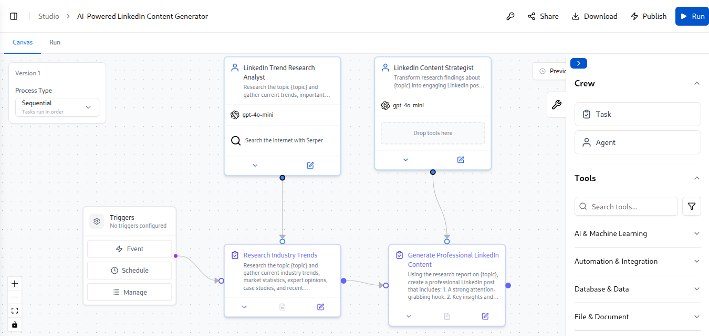
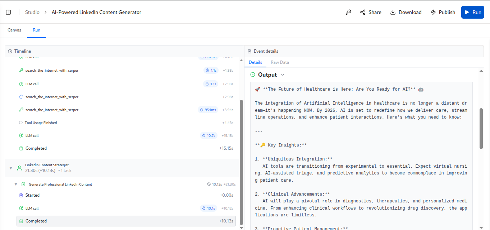
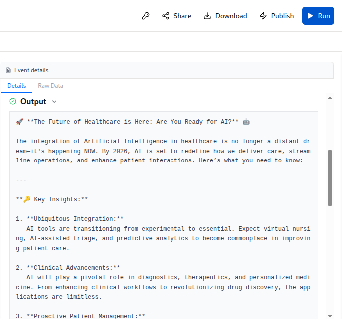

# 🚀 AI-Powered LinkedIn Content Generator

An AI-powered multi-agent content generation system built using CrewAI AMP and CrewAI Framework.

This project automates the process of researching industry trends and generating professional LinkedIn posts using specialized AI agents.

---

## 📌 Features

- Multi-Agent AI Workflow
- Automated Industry Trend Research
- Web Search Integration (Serper)
- Professional LinkedIn Content Generation
- Attention-Grabbing Hooks
- Industry Insights & Statistics
- Call-To-Action Generation
- Relevant Hashtag Recommendations
- Sequential Agent Collaboration
- Real-Time Topic Research

---

## 🏗️ Architecture

```text
User Topic Input
        ↓
LinkedIn Trend Research Analyst
        ↓
Research Industry Trends
        ↓
Research Report
        ↓
LinkedIn Content Strategist
        ↓
Generate Professional LinkedIn Content
        ↓
LinkedIn Ready Post
```

---

## 🤖 Agents

### 1. LinkedIn Trend Research Analyst

**Responsibilities:**
- Research current industry trends
- Gather statistics and market insights
- Find expert opinions
- Collect recent developments
- Generate structured research reports

**Tools Used:**
- Serper Web Search
- GPT-4o-mini

---

### 2. LinkedIn Content Strategist

**Responsibilities:**
- Transform research into engaging LinkedIn posts
- Create attention-grabbing hooks
- Generate actionable takeaways
- Add relevant hashtags
- Create compelling calls-to-action

**Tools Used:**
- GPT-4o-mini

---

## 📋 Tasks

### Research Industry Trends

The research agent performs:

- Industry trend analysis
- Market research
- Expert opinion collection
- Statistics gathering
- Recent development tracking
- Actionable insight extraction

### Generate Professional LinkedIn Content

The content strategist generates:

- Strong opening hook
- Professional storytelling
- Key insights and takeaways
- Industry-specific hashtags
- Call-to-action
- LinkedIn-optimized formatting

---

## 🛠️ Technologies Used

- CrewAI AMP
- CrewAI Framework
- OpenAI GPT-4o-mini
- Serper API
- Python
- Git
- GitHub

---

## ⚙️ Workflow

1. User provides a topic.
2. Research Agent searches the web and gathers relevant information.
3. Research Task compiles trends, statistics, and insights.
4. Content Strategist receives the research report.
5. Content Generation Task creates a professional LinkedIn post.
6. Final optimized LinkedIn content is generated.

---

## ▶️ Running Locally

### Install Dependencies

```bash
pip install uv
crewai install
```

### Run the Project

```bash
crewai run
```

---

## 🎯 Example Input

```text
Artificial Intelligence in Healthcare
```

---

## 📤 Example Output

A professional LinkedIn post containing:

- Strong Hook
- Industry Insights
- Actionable Takeaways
- Market Statistics
- Expert Opinions
- Call-To-Action
- Relevant Hashtags

---

## 📸 Project Screenshots

### Workflow Architecture



### Agent Execution



### Generated LinkedIn Post



---

## 🚀 Future Enhancements

- LinkedIn API Integration
- Automatic Post Scheduling
- Multi-Platform Content Generation
- AI Image Generation for Posts
- Content Performance Analytics
- Trend Monitoring Dashboard

---

## 📚 Learning Outcomes

Through this project, I gained hands-on experience with:

- Multi-Agent AI Systems
- CrewAI AMP
- CrewAI Framework
- Agent Collaboration Workflows
- AI Automation
- Prompt Engineering
- Web Search Integration
- Git & GitHub Version Control

---

## 👨‍💻 Author

**Sumanth Soma**

B.Tech Electronics & Communication Engineering (ECE)

Interested in:
- AI Automation
- Data Science
- Artificial Intelligence
- Embedded Systems
- IoT

GitHub: https://github.com/SUMANTH-SOMA

---

⭐ If you found this project interesting, consider giving the repository a star.
